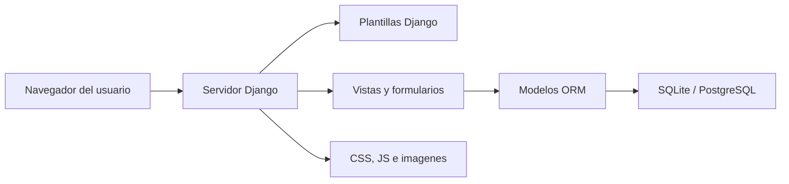
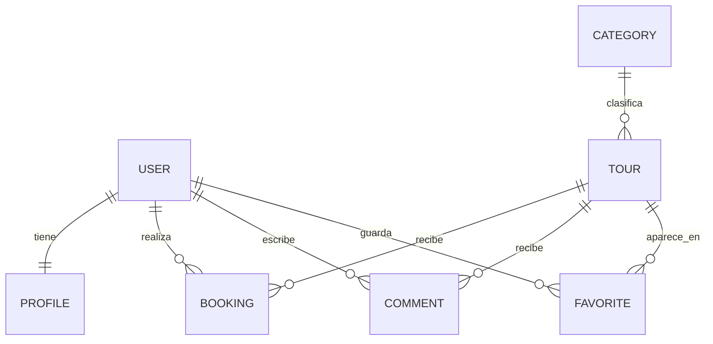

# Adventurero - Documentacion tecnica

## Descripcion del problema

Adventurero necesita pasar de un sitio estatico a una aplicacion web capaz de registrar usuarios, publicar tours, recibir reservas y persistir datos. La version Django agrega backend, base de datos, seguridad de formularios y una arquitectura mantenible.

## Stakeholders

- Administrador: gestiona tours, categorias, reservas y comentarios.
- Cliente/Turista: consulta tours, se registra, inicia sesion, reserva y comenta.
- Equipo academico: evalua arquitectura, requerimientos, pruebas y despliegue.

## Requerimientos funcionales

- RF1: registrar usuarios con contrasenas hasheadas por Django.
- RF2: iniciar y cerrar sesion.
- RF3: listar tours desde la base de datos.
- RF4: buscar y filtrar tours por categoria.
- RF5: crear, editar y eliminar tours solo con rol administrador o staff.
- RF6: crear reservas para usuarios autenticados.
- RF7: publicar comentarios asociados a un tour.
- RF8: consultar reservas propias.

## Requerimientos no funcionales

- Seguridad: CSRF activo, sesiones Django y validaciones backend.
- Persistencia: SQLite en desarrollo, migrable a PostgreSQL para produccion.
- Mantenibilidad: separacion por proyecto, app, modelos, formularios, vistas y plantillas.
- Usabilidad: mensajes de exito/error y navegacion principal consistente.
- Testing: pruebas de modelos, vistas, registro y reservas.

## Historias de usuario

- Como turista quiero registrarme para reservar tours.
- Como turista quiero filtrar tours para encontrar opciones segun mi interes.
- Como turista quiero reservar un tour indicando fecha y cantidad de personas.
- Como administrador quiero crear tours para mantener actualizada la oferta.
- Como administrador quiero editar o eliminar tours para corregir informacion.

## Arquitectura cliente-servidor

## Diagrama ER

## Modelo relacional

- `auth_user(id, username, email, password, first_name, is_staff, ...)`
- `core_profile(id, user_id, role, phone)`
- `core_category(id, name, slug, description)`
- `core_tour(id, category_id, title, country, place, description, price, capacity, days, image, is_featured, is_active)`
- `core_booking(id, user_id, tour_id, travel_date, people, status, notes, created_at)`
- `core_comment(id, user_id, tour_id, rating, body, is_visible, created_at)`
- `core_favorite(id, user_id, tour_id, created_at)`

## Despliegue recomendado

Para Render o Railway:

- Cambiar `DEBUG=False`.
- Definir `SECRET_KEY` por variable de entorno.
- Agregar dominio en `ALLOWED_HOSTS`.
- Usar PostgreSQL gestionado.
- Ejecutar `python manage.py migrate` y `python manage.py collectstatic`.

## Estructura Django actual

- `templates/`: unica fuente de HTML renderizado por Django.
- `templates/base.html`: layout central, navegacion, mensajes y carga de CSS/JS.
- `static`: recursos originales en `css/`, `js/` e `img/`.
- `media/`: imagenes gestionadas por campos `ImageField`, por ejemplo `media/tours/tour-6.avif`.
- `core/views.py`: vistas de negocio, incluyendo login/logout personalizados.
- `core/urls.py`: rutas de tours, reservas, registro y paginas internas.
